## Guidance for Automated Restore and Copy for Amazon S3 Glacier Objects

[Amazon S3](https://aws.amazon.com/s3/) Automated Archive Restore and
Copy solution provides an automated workflow to restore archived S3 data
stored in [Glacier Flexible Retrieval and Deep
Archive](https://aws.amazon.com/s3/storage-classes/) class to a new
storage class, using an in-place copy, copy to a new prefix within the
same S3 bucket or to another Amazon S3 bucket in the same or different
[AWS Account](https://aws.amazon.com/account/) or
[Region](https://aws.amazon.com/about-aws/global-infrastructure/regions_az/).
The solution orchestrates the steps involved in Archive restore,
including [Amazon S3 bucket
Inventory](https://docs.aws.amazon.com/AmazonS3/latest/userguide/storage-inventory.html)
generation, manifest query and optimization, archive retrieval, and copy
process. It also tracks the progress and send job status notifications
to the requester.

## Customer Value

The solution automates and orchestrates the multiple and often
repetitive manual tasks associated with Archive restore and copy for
customers that are planning to restore and migrate large set of archived
data

## Architecture and Components

**High Level Overview**

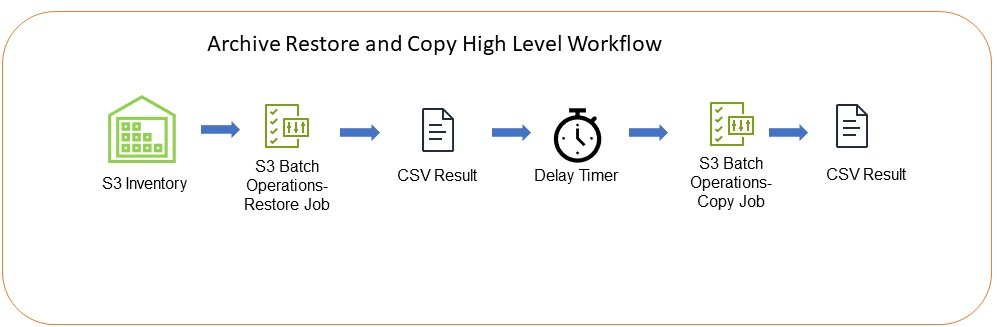

**AWS Services used:**

[Amazon Simple Storage Service (S3)](https://aws.amazon.com/s3/)

[AWS Step function](https://aws.amazon.com/step-functions/)

[AWS Lambda](https://aws.amazon.com/lambda/)

[Amazon DynamoDB](https://aws.amazon.com/dynamodb/)

[Amazon Eventbridge](https://aws.amazon.com/eventbridge/)

[AWS Glue](https://aws.amazon.com/glue/)

[Amazon Athena](https://aws.amazon.com/athena/)

[Amazon Simple Notification Service (SNS)](https://aws.amazon.com/sns/)

[AWS Identity and Access Management (IAM)](https://aws.amazon.com/iam/)

**Solution Core:**

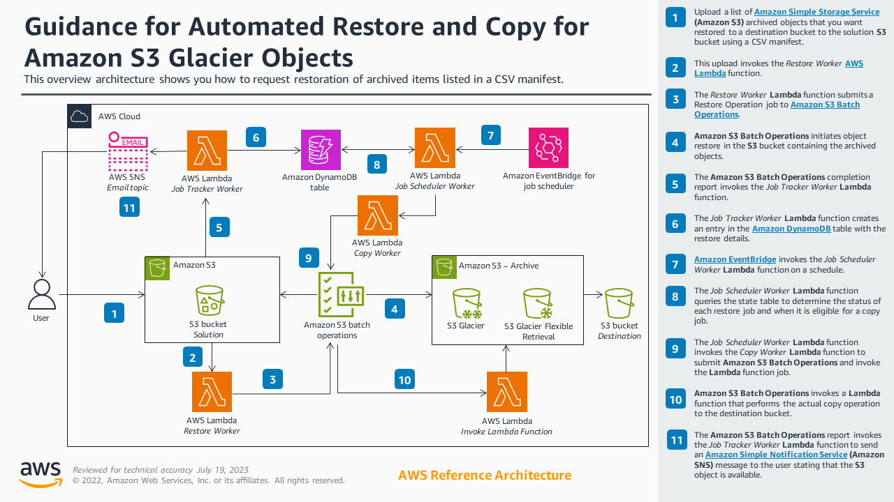

**Inventory/Manifest Generation, Chunking and Optimization Component**

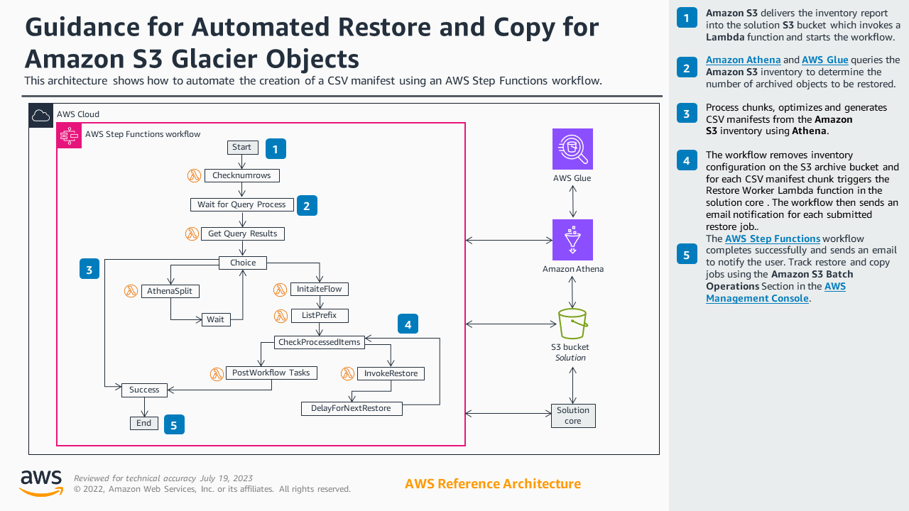

### Prerequisites

The instructions in this post assume that you have necessary account
permissions in addition to working knowledge of IAM roles, administering
Lambda functions, and managing S3 buckets in your AWS account. You also
need to have the following resources:

1.  An existing Amazon S3 Bucket containing the Archived objects

### Summary of the steps

1.  [Deploy](https://docs.aws.amazon.com/AWSCloudFormation/latest/UserGuide/GettingStarted.Walkthrough.html)
    the AWS CloudFormation template

2.  Specify the Amazon S3 Bucket name and optionally the prefix
    containing the Archived objects, the destination S3 bucket name and
    an optional prefix, the storage class of the source objects for
    example Glacier Flexible Retrieval or Glacier Deep Archive, the
    storage class to copy the objects to, then specify the version
    (current or All versions) and some additional parameters.

3.  Check your email address and subscribe to the SNS topic to receive
    Job notifications

4.  Monitor the job progress via Email and the Amazon S3 Batch
    Operations console to confirm it is successful, then check the
    destination S3 bucket to confirm the object has been copied
    successfully.

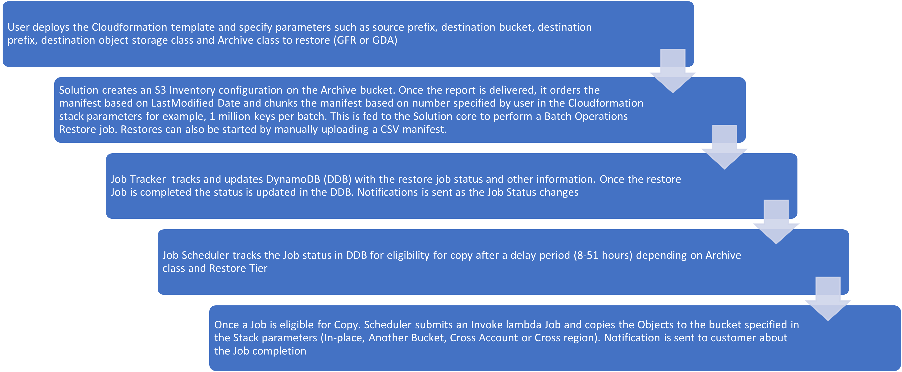

### Deployment

1.  Download the solution template
    "**automated-archive-restore-and-copy-solution-latest.yaml**" in the
    code section above

2.  Login to AWS Management Console and navigate to the AWS
    CloudFormation console.

3.  Choose **Create Stack (with new resources).** At the
    **Prerequisite** section, accept the default option Template is
    ready.

4.  At the **Specify Template section**, select **Upload a template
    file**, choose file and then use the previously downloaded
    CloudFormation template. After selecting, choose **Next**.

5.  Please see below the Cloudformation Stack parameters included in the
    template.


|  Name                               | Description |
|:--------------------------------- |:------------ |
|  Stack name                         | Any valid alphanumeric characters and hyphen |
|  Archived Bucket and Object Details | An existing Amazon S3 bucket containing the Archived Objects |
|  ArchiveBucketPrefix                | Prefix/folder you want to restore in your Archive Bucket |
|  IncludedObjectVersions             | Choose to restore Current Versions only or All Object Versions. All versions apply only to a versioned S3 bucket |
|  ExistingArchiveStorageClass        | Select the Archive storage class to restore, you can choose Glacier Flexible Retrieval or Glacier Deep Archive or Both |            
|  Destination Bucket                 | An existing Amazon S3 bucket where the restored archived objects will be copied to. This can be same bucket as Archive or a different S3 bucket, in the same of different AWS Account or AWS Region. \[See Performance and  Troubleshooting Section below\] |                                
|  Destination Bucket Prefix          | Destination Bucket Prefix /folder or Path |
|  ArchiveObjectRestoreDays           | Number of days to keep the temporary copy of the restored object. You can modify this value based on your unique requirements and to save on costs. |
|  ArchiveRestoreTier                 | This determines the time it takes for a restore job to finish and the temporary copy available for access. Standard retrieval typically takes about 3-5 hours and within 12 hours for Glacier Flexible Retrieval and Glacier Deep Archive respectively, while Bulk retrieval typically takes about 5-12 hours and within 48 hours for Glacier Flexible Retrieval and Glacier Deep Archive respectively. Bulk restore for objects in Glacier Flexible Retrieval are free. See the [S3 documentation](https://docs.aws.amazon.com/AmazonS3/latest/userguide/restoring-objects-retrieval-options.html) for more details |                                      
|  CopyMetadata                       | This option allows you to copy source object metadata to source. |
|  CopyTagging                        | Enable or disable copying source object tags to destination |
|  StorageClass                       | Choose the desired destination storage class |
|  RecipientEmail                     | User email address to receive Job notifications. Please remember to Confirm the Subscription |
|  MaxInvKeys                         | Specify the maximum number of keys in each manifest and Batch operations Job. For larger individual object sizes, for example, tens or hundreds of gigabytes to terabytes, consider choosing a smaller value. |
|  TransferMaximumConcurrency         | AWS SDK parameter, maximum number of concurrent requests SDK uses \[See Performance and Troubleshooting Section below\] |
|  SDKMaxPoolConnections              | AWS SDK parameter, maximum number of connections SDK keeps in a connection pool \[See Performance and Troubleshooting Section below\] |
|  SDKMaxErrorRetries                 | AWS SDK parameter, number of SDK error retries \[See Performance and Troubleshooting Section below\] |
|  MultipartChunkSize                 | AWS SDK parameter S3 multipart Chunk size in bytes (MB\*1024\*1024) that the SDK uses for multipart transfers. |
|  CopyFunctionReservedConcurrency    | Choose Unreserved to allow S3 Batch utilize up to 1,000 Lambda function concurrency, or optionally specify the reserved concurrency for the Lambda function S3 Batch Operations Invokes to perform Copy operations. Note, setting a value impacts the concurrency pool available to other functions. \[See Performance and Troubleshooting Section below\] |
                                      
                                      
                                      


6.  Cloudformation will automatically deploy the solution's components,
    perform some initial checks and actions including enabling S3
    inventory configuration on the Archive bucket.

7.  At the **Configure stack options** page, choose **Next** to proceed.
    At the next page, scroll down to accept the acknowledgement and
    **Create Stack**.

**Cloudformation Console Screenshots:**


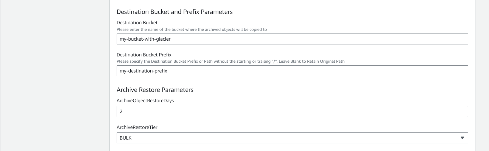

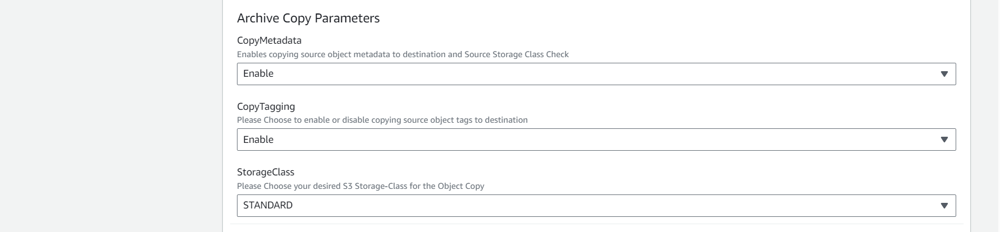

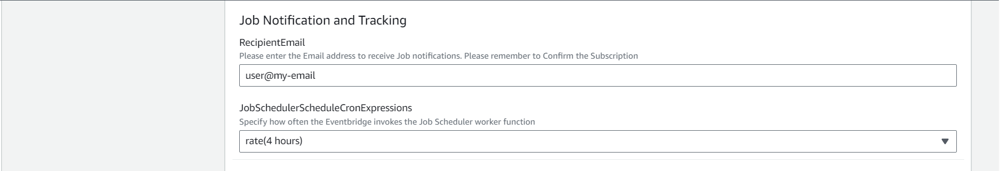

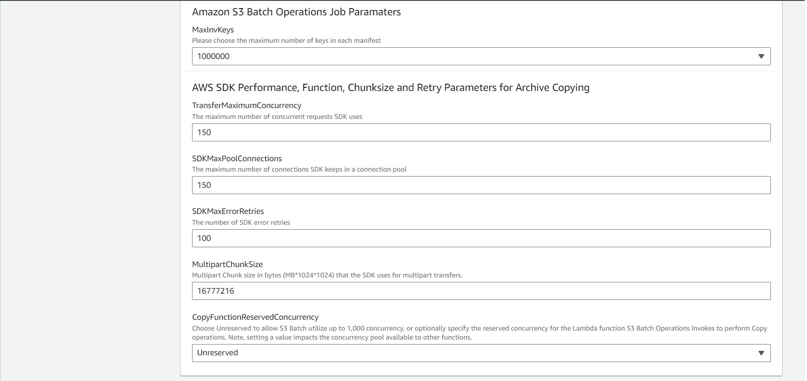

Please remember to confirm the Amazon SNS notification Subscription sent
to the email address you provided earlier. Confirming the subscription
allow you to receive Job notifications emails.

#### Cross-account scenario

If the destination S3 bucket is in another AWS account, then you must
also apply a resource level [bucket
policy](https://docs.aws.amazon.com/AmazonS3/latest/userguide/bucket-policies.html)
to the S3 bucket with the required permissions. See the following S3
bucket policy example with the minimum required permissions:

```
{
    "Version": "2012-10-17",
    "Id": "Policy1541018284691",
    "Statement": [
        {
            "Sid": "Allow Cross Account Copy",
            "Effect": "Allow",
            "Principal": {
                "AWS": "arn:aws:iam::1234567890:root"
            },
            "Action": [
                "s3:PutObject",
                "s3:PutObjectAcl",
	 "s3:PutObjectTagging"
            ],
            "Resource": "arn:aws:s3:::DESTINATION_BUCKET/*"
        }
    ]
}

```

Where "1234567890" in the bucket policy Principal is the source Account
AWS
[Account-ID](https://docs.aws.amazon.com/general/latest/gr/acct-identifiers.html).
You can optionally set [Object
Ownership](https://docs.aws.amazon.com/AmazonS3/latest/userguide/about-object-ownership.html#enable-object-ownership)
on the destination account bucket to **Bucket owner preferred** or
[**disable
ACLs**](https://docs.aws.amazon.com/AmazonS3/latest/userguide/ensure-object-ownership.html)
to ensure that the destination account owns the objects.

#### KMS Encrypted Amazon S3 Buckets

If the source and destination Amazon S3 bucket has default encryption
with [Customer Managed
KMS](https://docs.aws.amazon.com/kms/latest/developerguide/concepts.html#key-mgmt),
you will need to grant the solution AWS Lambda Copy function IAM role
[access to the KMS
Key](https://docs.aws.amazon.com/kms/latest/developerguide/control-access.html).
To locate the solution IAM role, please goto the CloudFormation
**Stack** you just created, choose the Resources section, copy and paste
***S3BatchCopyLambdaFunctionIamRole*** into the **Search Resources**
field. Choose the link under the **PhysicalID** column, this will open a
new browser tab with the details of the IAM role.

#### Initiating and Tracking the Restore and Copy Jobs

Now that you have successfully deployed the CloudFormation Stack, the
solution **Manifest Generation, Batching and Optimization Component**
will automatically start the restore and copy workflow as soon as the
first Amazon S3 Inventory report for the Archive bucket is delivered
into the Solution S3 bucket, it might take up to [48 hours for Amazon S3
to deliver the first inventory
report](https://docs.aws.amazon.com/AmazonS3/latest/userguide/configure-inventory.html#configure-inventory-console).
The Component assigns a **JobGroupID** and proceeds to split the
automatically generated S3 Inventory into smaller CSV manifest chunks
based on the parameter specified in the CloudFormation Stack.

Each chunk is automatically submitted to S3 Batch Operations Restore Job
at a 6-hour interval. If you have a very large number of objects in the
prefix or bucket, and want the overall restore workflow to complete
faster, you can choose a higher value for the chunk size. For example,
if you have 5 million objects and you set 1 million as the value for
Stack parameter "***MaxInvkeys***", the solution will take about 24
hours to fully submit all the keys to S3 Batch Operations for restore.
The S3 inventory configuration on the Archive bucket is automatically
deleted when the restore workflow is started.

When all the objects within the Archive S3 bucket or prefix have been
successfully restored and copied, then you can update the CloudFormation
Stack parameters to perform the same restore and copy workflow on a
different S3 bucket or another prefix within the same S3 bucket.

Please note that the filtering, chunking and optimization only applies
to the automatically generated manifest.

You can immediately initiate the restore and copy workflow by manually
uploading a manifest CSV file directly to the solution S3 bucket. If you
choose to use this option, you might want to [disable the automatically
generated S3 inventory
report](https://docs.aws.amazon.com/AmazonS3/latest/userguide/configure-inventory.html)
configuration on the Archive bucket. To locate the solution S3 bucket
name, please goto the CloudFormation stack you just created, choose the
Output section and copy the Value of "**BucketName"** see sample
screenshot below:

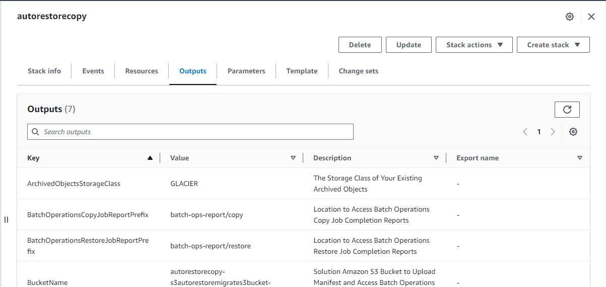

Next go to Amazon S3 Management Console, Buckets and search for the
bucket name. Choose the S3 bucket name and navigate to the
"restore-and-copy/csv-manifest/" prefix. You have the option of
uploading a manifest for objects without a [**version-id** or with
**version-ids**](https://docs.aws.amazon.com/AmazonS3/latest/userguide/batch-ops-create-job.html#specify-batchjob-manifest).

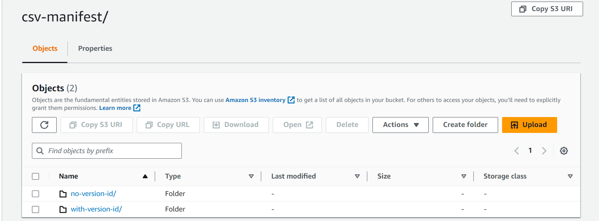

For example, if the bucket containing your Archived data does not have
versioning enabled you should upload the CSV manifest to the
"restore-and-copy/csv-manifest/no-version-id/".

If you have confirmed the subscription to the solution SNS Topic, you
will receive email notifications with details of each JobID and the
number of successful and failed tasks.

You can also track the status of the restore and copy Jobs using the
Amazon S3 Management Console at the Batch Operations Section if you want
to see additional details about each Job and access the detailed Batch
operations Job report. Each Job created by the solution has the
"*AutoRestoreMigrate Solution*" string in it, for example a restore job
will have "*Restore Job by AutoRestoreMigrate Solution for S3Bucket:
YourS3BucketName*\" as the description, copy Jobs will have the
description \"*Lambda Invoke Copy Job by AutoRestoreMigrate Solution for
S3Bucket: YourS3BucketName*\"

To check detailed status of a Job, follow below steps:

1.  Go to the [Amazon S3
    console](https://s3.console.aws.amazon.com/s3/home).

2.  From the navigation pane, choose **Batch Operations** and choose the
    correct AWS Region, then type your search parameter using the JobID
    or description.

3.  Choose the JobID, to display Job specific details. See this
    [link](https://docs.aws.amazon.com/AmazonS3/latest/userguide/batch-ops-job-status.html)
    for more details about tracking Job status.

## Performance and Troubleshooting

The solution uses the Amazon S3 Batch Operations Lambda Invoke Job for
the copy operation. Not all objects larger than 5 GB can be copied
within the current Lambda function 15-minute timeout limit, especially
across AWS Regions. The solution has been tested successfully, under
ideal conditions, with up to 2-TB single objects size in the same region
and with a 1-TB single object size between two regions EU-WEST-2 and
US-EAST-1.

The template contains some predefined values that apply to the Lambda
function Boto3 SDK code, mainly: **max_concurrency**: *200*,
**max_pool_connections**: *200*, **max_retries**: *100*, and
**multipart_chunksize**: *16777216*. You can optionally modify the SDK
parameters as required. For example, you can reduce the
**max_concurrency** and **max_pool_connections** up to 150 if your
source and destination bucket are the same or within the same AWS Region
from the region the solution and Archive bucket is created.
Alternatively, you might want to increase it, if you have very large
individual object sizes for example several hundred gigabytes to
terabytes, you need to copy data across AWS regions and if the
predefined parameters are insufficient.

The solution is dependent on the availability and performance of
multiple underlying AWS services including S3, Lambda and IAM services.

Amazon S3 Batch Operations (BOPs) is an at least once execution engine,
which means it performs at least one invocation per key in the provided
manifest. In rare cases, there might be more than one invocation per
key, this might lead to task failures.

The values of SDK configuration settings ***max_pool_connections*** and
***max_concurrency*** is set to a high value, please note that due to
the increased request rates, you might experience throttling from Amazon
S3 during the Copy Operation. Excessive throttling can lead to longer
running tasks, and possible task failures.

As a best practice, we recommend applying a [lifecycle
expiration](https://docs.aws.amazon.com/AmazonS3/latest/userguide/mpu-abort-incomplete-mpu-lifecycle-config.html)
rule to expire incomplete multipart uploads to your S3 bucket that might
be caused by failed tasks as a result of Lambda function timeouts.

To address performance issues, please refer to [S3 performance
guidelines](https://docs.aws.amazon.com/AmazonS3/latest/userguide/optimizing-performance.html).
I have also provided some quick tips below:

1.  Consider enabling [S3 Request
    metrics](https://docs.aws.amazon.com/AmazonS3/latest/userguide/metrics-configurations.html)
    to track and monitor the request rates and number of 5XX errors on
    your S3
    [bucket](https://docs.aws.amazon.com/AmazonS3/latest/userguide/configure-request-metrics-bucket.html).

2.  Please consider reducing your request rate, by reducing the
    "max_concurrency" and "max_pool_connections" to a lower value, by
    updating the CloudFormation Stack parameters before starting the
    Job.

3.  Job tasks that failed with "Task timed out after 9xxx seconds" is
    caused by the Lambda function timeout. Possible reasons for Lambda
    timeout include S3 throttling causing the function to keep retrying
    the task until the function times out, it can also be caused if the
    object size is too large to be copied within the lambda timeout
    limit. Please adjust the SDK configurations as needed to meet your
    unique requirements.

4.  S3 Batch Operations will utilize all available Lambda concurrency,
    up to 1,000. If you have a need to reserve some concurrency for
    other Lambda functions, you can optionally reduce the concurrency
    used by a Lambda function by setting the reserved concurrency in the
    **Stack** parameter **"CopyFunctionReservedConcurrency",** and
    specify a desired value less than 1,000. Note, setting a value
    impacts the concurrency pool available to other functions.

5.  S3 Batch Operations [automatically uses up to 1,000
    TPS](https://docs.aws.amazon.com/AmazonS3/latest/userguide/restoring-objects-retrieval-options.html)
    when restoring objects from S3 Glacier Flexible Retrieval or S3
    Glacier Deep Archive for both archive retrieval options.

6.  The \"Inventory/Manifest generation Component\" relies on Amazon
    Athena SQL query "ORDER BY" , "LIMIT" and OFFSET" clause to perform
    the chunking, if your S3 bucket contains several hundreds of
    millions of objects or more, this might trigger \"[Resource
    limits](https://docs.aws.amazon.com/athena/latest/ug/performance-tuning.html#performance-tuning-resource-limits)\"
    related errors, consider using the \"ArchiveBucketPrefix\"
    Cloudformation **Stack** parameter to limit the total number of
    objects that will be included in each generated S3 Inventory
    manifest. Alternatively, you can generate your own CSV manifest and
    upload directly to the solution S3 bucket to initiate the restore
    and copy workflow as shown in the "**Initiation and tracking
    Section**" above.

7.  If issues with slow performance, excessive throttling, or other
    issues persist, contact AWS Support with the error message and [S3
    RequestID and Extended
    RequestID](https://docs.aws.amazon.com/AmazonS3/latest/userguide/get-request-ids.html)
    in the Amazon S3 Batch Operations failure
    [report](https://docs.aws.amazon.com/AmazonS3/latest/userguide/batch-ops-examples-reports.html)
    or [function CloudWatch
    Logs](https://docs.aws.amazon.com/lambda/latest/dg/python-logging.html),
    for additional support. You can also get S3 requestIDs by querying
    [S3 Access or
    Cloudtrail](https://docs.aws.amazon.com/AmazonS3/latest/userguide/logging-with-S3.html)
    logs if enabled.

For very large workloads; hundreds of millions of objects or Terabytes
of data or critical workloads with tight deadlines, please consider
contacting your AWS Account contact before starting the restore and copy
process.

**Note:**

1.  Failed task in each restore. The manifest file automatically
    generated from Amazon S3 Inventory contains a CSV header row,
    because [S3 Batch Operations does not support header rows on
    CSV](https://docs.aws.amazon.com/AmazonS3/latest/userguide/inventory-configure-bops.html)
    you will notice one failed task in the restore job.

## Costs

There are costs associated with using this solution including Step
function, Athena, SNS, S3 requests and Lambda function invocation costs.

[Example solution cost for restoring and copying 10,738,039 objects and
2.1 PB in Glacier Flexible Retrieval in US-EAST-2 to Standard (Archive
S3 bucket and Batch Operations API Costs not included)]

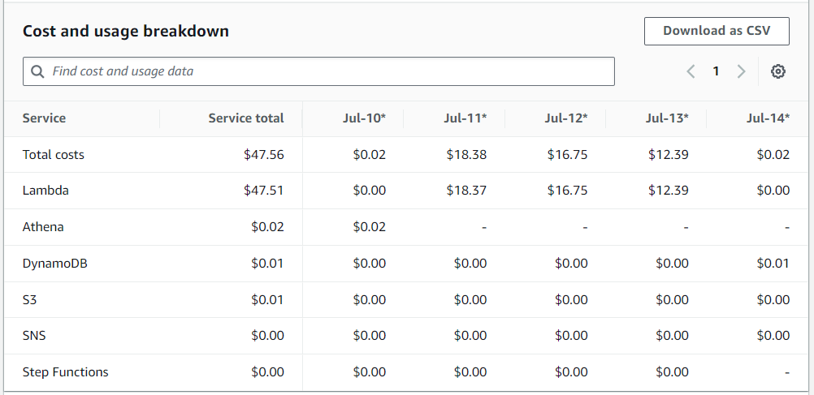

## Cleaning up

There are costs associated with using this solution including S3
requests and Lambda function invocation costs.

A lifecycle rule automatically applied to the solution Amazon S3 bucket
expires all objects after 180 days, if you need to retain the data for a
longer period, please copy them to another bucket.

As an optional step, remember to clean up the resources used for this
setup if they are no longer required. To remove the resources, go to the
[Cloudformation
console](https://console.aws.amazon.com/cloudformation/), select the
**Stack** and then choose **Delete**. The solution S3 bucket is retained
after **Stack** deletion, to allow you access the S3 Batch Operations
Job reports, inventory and CSV manifests. After you delete the Stack,
you can optionally [modify the lifecycle
rule](https://docs.aws.amazon.com/AmazonS3/latest/userguide/how-to-set-lifecycle-configuration-intro.html)
to 1 day if you do not want to keep the data, this will expire the
objects and you can delete the bucket as soon as it is empty.

### Additional resources

-   [AWS CloudFormation product
    page](https://aws.amazon.com/cloudformation/)

-   [S3 Batch Operations
    documentation](https://docs.aws.amazon.com/AmazonS3/latest/userguide/batch-ops.html)

-   [AWS Lambda product page](https://aws.amazon.com/lambda/)

-   [Amazon S3 pricing page](https://aws.amazon.com/s3/pricing/)

-   [AWS Lambda pricing page](https://aws.amazon.com/lambda/pricing/)

-   [Amazon S3 Performance
    Guidelines](https://docs.aws.amazon.com/AmazonS3/latest/userguide/optimizing-performance.html)

-   [AWS Lambda Performance
    Guidelines](https://docs.aws.amazon.com/lambda/latest/operatorguide/perf-optimize.html)

-   [Serverless Workflow Orchestration -- AWS Step Functions -- Amazon
    Web Services](https://aws.amazon.com/step-functions/)

-   [AWS Step Functions Pricing \| Serverless Microservice Orchestration
    \| Amazon Web
    Services](https://aws.amazon.com/step-functions/pricing/)

-   [Push Notification Service - Amazon Simple Notification Service
    (SNS) - AWS](https://aws.amazon.com/sns/)

-   [Fast NoSQL Key-Value Database -- Amazon DynamoDB -- Amazon Web
    Services](https://aws.amazon.com/dynamodb/)

-   [Serverless Data Integration -- AWS Glue -- Amazon Web
    Services](https://aws.amazon.com/glue/)

-   [Interactive SQL - Serverless Query Service - Amazon Athena -
    AWS](https://aws.amazon.com/athena/)

-   [Performance tuning in Athena - Amazon
    Athena](https://docs.aws.amazon.com/athena/latest/ug/performance-tuning.html)

-   [What is IAM? - AWS Identity and Access Management
    (amazon.com)](https://docs.aws.amazon.com/IAM/latest/UserGuide/introduction.html)
