## Guidance for Automated Restore and Copy for Amazon S3 Glacier Objects

## Table of Contents
1. [Overview](#overview)
    - [Customer Value](#customer-value)
    - [Architecture and Components](#architecture-and-components)
     - [High Level Overview - Amazon S3 Batch Operations Copy](#amazon-s3-batch-operations-copy)
     - [High Level Overview - Event Driven Copy](#event-driven-copy)
    - [AWS Services used](#aws-services-used)    
    - [Costs](#costs)
    - [Prerequisites](#prerequisites)
2. [Deployment](#deployment)
    - [Deployment Steps](#deployment-steps)
    - [Cross-account scenario](#cross-account-scenario)
    - [KMS Encrypted Amazon S3 Buckets](#kms-encrypted-amazon-s3-buckets)
3. [Initiating and Tracking the Restore and Copy Jobs](#initiating-and-tracking-the-restore-and-copy-jobs)
4. [Copy Workflow for Restored objects](#copy-workflow-for-restored-objects)
   - [Copy with Batch Operations and Lambda after delay period](#batch-operations-copy-after-delay)
   - [Copy immediately restore is completed with S3 Event notifications](#event-driven-copy-job)
5. [Redrive Failed Copy Jobs ](#redrive-failed-copy-jobs)
   - [Redriving copy when Copy with Batch Operations and Lambda after delay period is selected](#redrive-failed-batch-operations-copy)
   - [Redriving copy when Copy immediately restore is completed with S3 Event notifications is selected](#redrive-failed-event-driven-copy)
6. [Cleanup](#cleanup)
7. [Additional Resources](#additional-resources)


<a name="overview"></a>
## Overview

[Amazon S3](https://aws.amazon.com/s3/) Automated Archive Restore and
Copy solution provides an automated workflow to restore archived S3 data
stored in [Glacier Flexible Retrieval and Deep
Archive](https://aws.amazon.com/s3/storage-classes/) class to a new
storage class, using an in-place copy, copy to a new prefix within the
same S3 bucket or to another Amazon S3 bucket in the same or different
[AWS Account](https://aws.amazon.com/account/) or
[Region](https://aws.amazon.com/about-aws/global-infrastructure/regions_az/).
The solution orchestrates the steps involved in Archive restore,
including [manifest generation](https://docs.aws.amazon.com/AmazonS3/latest/userguide/batch-ops-create-job.html#specify-batchjob-manifest) archive retrieval, and copy
process. It also tracks the progress and send job status notifications
to the requester. 

<a name="customer-value"></a>
### Customer Value

The solution automates and orchestrates the multiple and often
repetitive manual tasks associated with Archive restore and copy for
customers that are planning to restore and migrate large set of archived
data. With the latest update, manifest generation starts immediately with the Batch Operations manifest generation feature.

<a name="architecture-and-components"></a>
### Architecture and Components

<a name="amazon-s3-batch-operations-copy"></a>
**High Level Overview - Amazon S3 Batch Operations Copy**

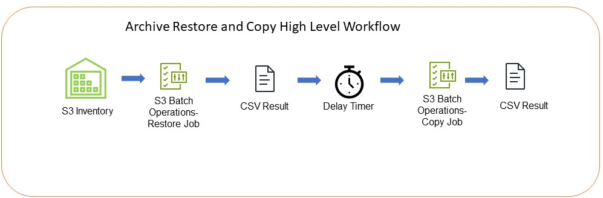

**Solution Architecture - Amazon S3 Batch Operations copy :**

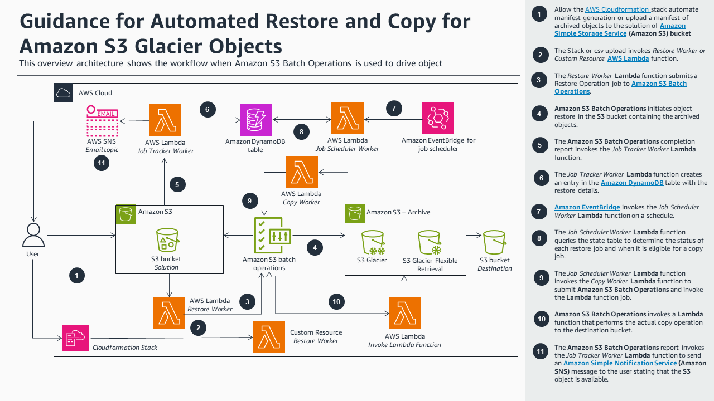


<a name="event-driven-copy"></a>
**High Level Overview - Event Driven Copy**

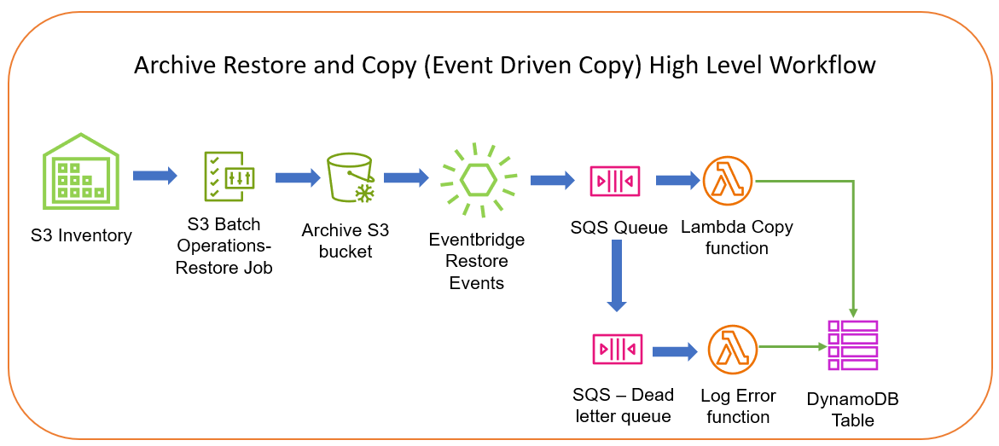


**Solution Architecture - Amazon S3 Event driven copy :**

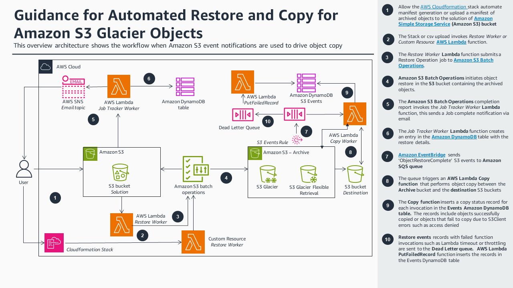

<a name="aws-services-used"></a>
**AWS Services used:**

[Amazon Simple Storage Service (S3)](https://aws.amazon.com/s3/)

[AWS Lambda](https://aws.amazon.com/lambda/)

[Amazon DynamoDB](https://aws.amazon.com/dynamodb/)

[Amazon CloudWatch](https://aws.amazon.com/cloudwatch/)

[Amazon Eventbridge](https://aws.amazon.com/eventbridge/)

[Amazon Simple Queue Service](https://aws.amazon.com/sqs/)

[Amazon Simple Notification Service (SNS)](https://aws.amazon.com/sns/)

[AWS Identity and Access Management (IAM)](https://aws.amazon.com/iam/)

<a name="costs"></a>
### Costs

There are costs associated with using this solution including Eventbridge, Simple Queue Service (SQS), Athena, SNS, S3 requests and Lambda function invocation costs.

[Example solution cost for restoring and copying 10,738,039 objects and
2.1 PB in Glacier Flexible Retrieval in US-EAST-2 to Standard using "Batch Operations and Lambda Copy" (Archive
S3 bucket and Batch Operations API Costs not included)]

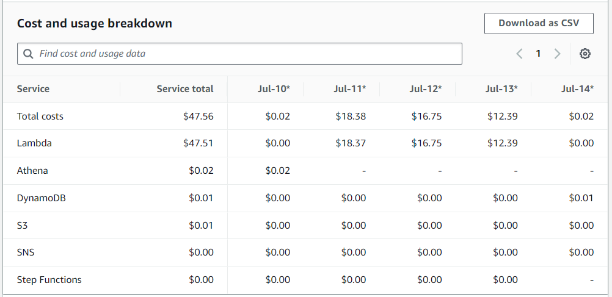

[Example solution cost for restoring and copying 172M objects and
341 GB in Glacier Flexible Retrieval in EU-WEST-2 to Standard using "Event driven Copy" (Archive
S3 bucket and Batch Operations API Costs not included)]

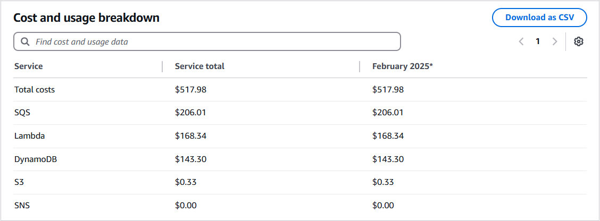


<a name="prerequisites"></a>
### Prerequisites

The instructions in this post assume that you have necessary account
permissions in addition to working knowledge of IAM roles, administering
Lambda functions, and managing S3 buckets in your AWS account. You also
need to have the following resources:

1.  An existing Amazon S3 Bucket containing the Archived objects

<a name="deployment"></a>
## Deployment 

1.  [Deploy](https://docs.aws.amazon.com/AWSCloudFormation/latest/UserGuide/GettingStarted.Walkthrough.html)
    the AWS CloudFormation template

2.  Specify the Amazon S3 Bucket name and optionally the prefix
    containing the Archived objects, the destination S3 bucket name and
    an optional prefix, the storage class of the source objects for
    example Glacier Flexible Retrieval or Glacier Deep Archive, the
    storage class to copy the objects to, and some additional parameters.

3.  Check your email address and subscribe to the SNS topic to receive
    Job notifications

4.  Monitor the job progress via Email and the Amazon S3 Batch
    Operations console to confirm it is successful, then check the
    destination S3 bucket to confirm the object has been copied
    successfully.

*Restore and Copy with S3 Batch Operations*

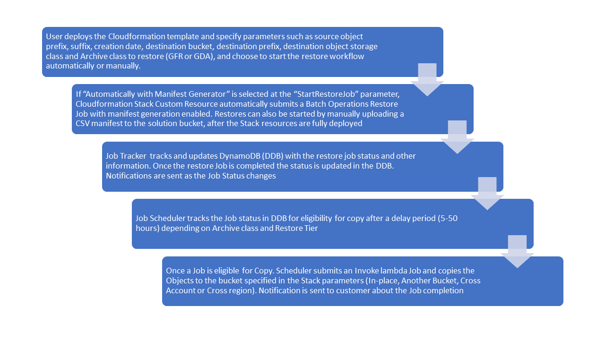

*Restore with S3 Batch Operations with Event Driven Copy*

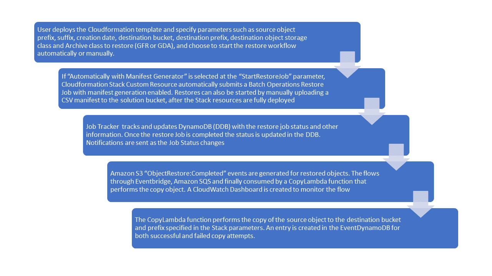

<a name="deployment-steps"></a>
### Deployment Steps

1.  Download the solution template
    ["**automated-archive-restore-and-copy-solution-latest.yaml**"](automated-archive-restore-and-copy-solution-latest.yaml) in the
    code section above

2.  Login to AWS Management Console and navigate to the AWS
    CloudFormation console.

3.  Choose **Create Stack (with new resources).** At the
    **Prerequisite** section, accept the default option Template is
    ready.

4.  At the **Specify Template section**, select **Upload a template
    file**, choose file and then use the previously downloaded
    CloudFormation template. After selecting, choose **Next**.

5.  Please see below the Cloudformation Stack parameters included in the
    template.


|  Name                               | Description |
|:--------------------------------- |:------------ |
|  Stack name                         | Any valid alphanumeric characters and hyphen |
|  Archived Bucket | An existing Amazon S3 bucket containing the Archived Objects |
|  ExistingArchiveStorageClass        | Select the Archive storage class to restore, you can choose Glacier Flexible Retrieval or Glacier Deep Archive or Both |
|  ArchiveBucketPrefix                | Prefix/folder you want to restore in your Archive Bucket. |
|  ArchiveBucketObjectSuffix          | Suffix of objects you want to restore, for example .csv or .json |   
|  ArchiveBucketObjectCreatedBefore   | Include objects created before the specified time | 
|  ArchiveBucketObjectCreatedAfter    | Include objects created after the specified time | 
|  ArchiveBucketObjectSizeGreaterThan | Include objects with size greater than the specified number of bytes | 
|  ArchiveBucketObjectSizeLessThan    | Include objects with size less than the specified number of bytes |  
|  StartRestoreJob   | Please choose how you want to start the restore and copy workflow. You can manually upload your CSV manifest or automatically start the restore job using Batch Operations automated manifest generator  |         
|  Destination Bucket                 | An existing Amazon S3 bucket where the restored archived objects will be copied to. This can be same bucket as Archive or a different S3 bucket, in the same of different AWS Account or AWS Region. \[See Performance and  Troubleshooting Section below\] |                                
|  Destination Bucket Prefix          | Destination Bucket Prefix /folder or Path |
|  ArchiveObjectRestoreDays           | Number of days to keep the temporary copy of the restored object. You can modify this value based on your unique requirements and to save on costs. |
|  ArchiveRestoreTier                 | This determines the time it takes for a restore job to finish and the temporary copy available for access. Standard retrieval typically takes about 3-5 hours and within 12 hours for Glacier Flexible Retrieval and Glacier Deep Archive respectively, while Bulk retrieval typically takes about 5-12 hours and within 48 hours for Glacier Flexible Retrieval and Glacier Deep Archive respectively. Bulk restore for objects in Glacier Flexible Retrieval are free. See the [S3 documentation](https://docs.aws.amazon.com/AmazonS3/latest/userguide/restoring-objects-retrieval-options.html) for more details |       
|  CopyMethod          | Please choose how you want to start the copy workflow. You can start the copy after a delay period with Batch Operations or immediately as soon as object restore is completed with Eventbridge notifications |                               
|  CopyMetadata                       | This option allows you to copy source object metadata to source. |
|  CopyTagging                        | Enable or disable copying source object tags to destination |
|  StorageClass                       | Choose the desired destination storage class |
|  RecipientEmail                     | User email address to receive Job notifications. Please remember to Confirm the Subscription |
|  MaxInvKeys                         | Specify the maximum number of keys in each manifest and Batch operations Job. For larger individual object sizes, for example, tens or hundreds of gigabytes to terabytes, consider choosing a smaller value. |
|  SDKThroughput         | AWS SDK parameter, maximum number of concurrent requests and number of connections the connection pool \[See Performance and Troubleshooting Section below\] |
|  MultipartThreshold                 | Multipart Threshold size in bytes (MB*1024*1024) when the SDK switches to multipart transfers |
|  MultipartChunkSize                 | AWS SDK parameter S3 multipart Chunk size in bytes (MB\*1024\*1024) that the SDK uses for multipart transfers. |
|  CopyFunctionReservedConcurrency    | Choose Unreserved to allow S3 Batch utilize up to 1,000 Lambda function concurrency, or optionally specify the reserved concurrency for the Lambda function S3 Batch Operations Invokes to perform Copy operations. Note, setting a value impacts the concurrency pool available to other functions. \[See Performance and Troubleshooting Section below\] |

**_Note:_** : the "Include logs created AFTER" date cannot be the same date as "Include logs created BEFORE" date, it has to be earlier!

6.  Cloudformation will automatically deploy the solution's components,
    perform some initial checks and actions including starting an Amazon S3 Batch Operation restore job.

7.  At the **Configure stack options** page, choose **Next** to proceed.
    At the next page, scroll down to accept the acknowledgement and
    **Create Stack**.

**Cloudformation Console Screenshots:**

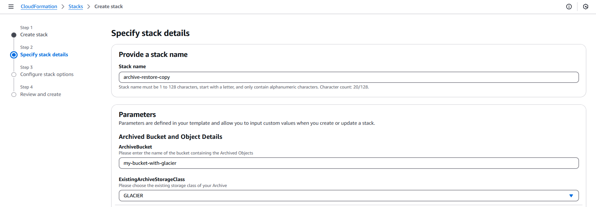

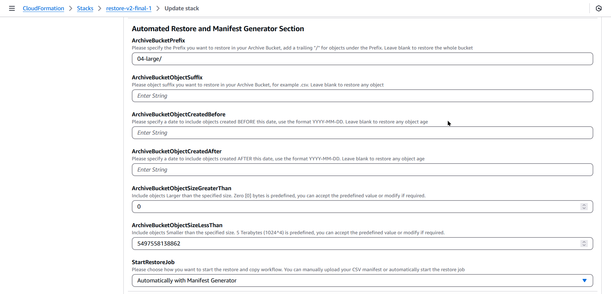

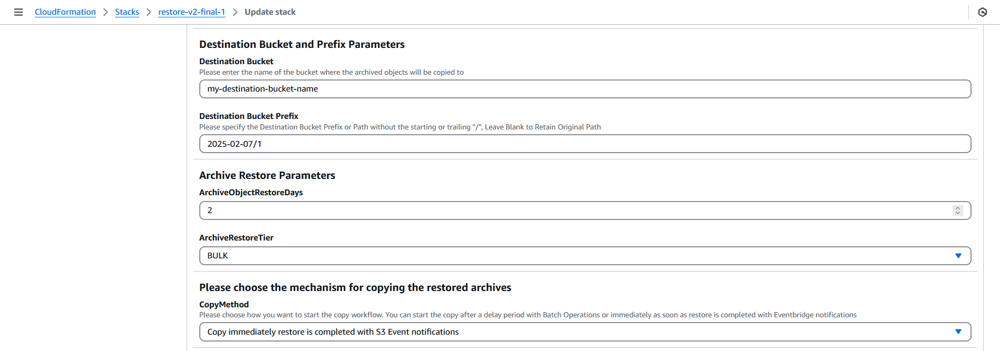

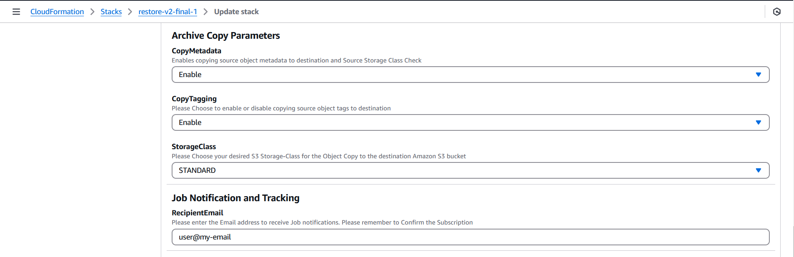

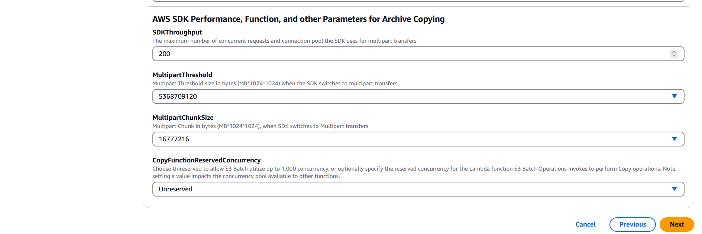

Please remember to confirm the Amazon SNS notification Subscription sent
to the email address you provided earlier. Confirming the subscription
allow you to receive Job notifications emails.

<a name="cross-account-scenario"></a>
#### Cross-account scenario

If the destination S3 bucket is in another AWS account, then you must
also apply a resource level [bucket
policy](https://docs.aws.amazon.com/AmazonS3/latest/userguide/bucket-policies.html)
to the S3 bucket with the required permissions. See the following S3
bucket policy example with the minimum required permissions:

```
{
    "Version": "2012-10-17",
    "Id": "Policy1541018284691",
    "Statement": [
        {
            "Sid": "Allow Cross Account Copy",
            "Effect": "Allow",
            "Principal": {
                "AWS": "arn:aws:iam::1234567890:root"
            },
            "Action": [
                "s3:PutObject",
                "s3:PutObjectAcl",
	 "s3:PutObjectTagging"
            ],
            "Resource": "arn:aws:s3:::DESTINATION_BUCKET/*"
        }
    ]
}

```

Where "1234567890" in the bucket policy Principal is the source Account
AWS
[Account-ID](https://docs.aws.amazon.com/general/latest/gr/acct-identifiers.html).
You can optionally set [Object
Ownership](https://docs.aws.amazon.com/AmazonS3/latest/userguide/about-object-ownership.html#enable-object-ownership)
on the destination account bucket to **Bucket owner preferred** or
[**disable
ACLs**](https://docs.aws.amazon.com/AmazonS3/latest/userguide/ensure-object-ownership.html)
to ensure that the destination account owns the objects.

<a name="kms-encrypted-amazon-s3-buckets"></a>
#### KMS Encrypted Amazon S3 Buckets

If the source and destination Amazon S3 bucket has default encryption
with [Customer Managed
KMS](https://docs.aws.amazon.com/kms/latest/developerguide/concepts.html#key-mgmt),
you will need to grant the solution AWS Lambda Copy function IAM role
[access to the KMS
Key](https://docs.aws.amazon.com/kms/latest/developerguide/control-access.html).
To locate the solution IAM role, please goto the CloudFormation
**Stack** you just created, choose the Resources section, copy and paste
***S3BatchCopyLambdaFunctionIamRole*** into the **Search Resources**
field. Choose the link under the **PhysicalID** column, this will open a
new browser tab with the details of the IAM role. You can also retrieve the IAM role ARN from the Stack Output section.

<a name="initiating-and-tracking-the-restore-and-copy-jobs"></a>
## Initiating and Tracking the Restore and Copy Jobs

Now that you have successfully deployed the CloudFormation Stack. If you choose the Stack parameter "Start Restore - Automatically with Manifest Generator", the solution will automatically initiate a Batch Operations restore job. The restore process will start as soon as the Amazon S3 Batch Operation manifest generation is complete. Manifest generation could take couple of minutes to hours depending on the number of objects included in the filters specified above. You can filter objects included by including values for "CreatedAfter", "CreatedBefore", "MatchAnyPrefix", "MatchAnySuffix", "ObjectSizeGreaterThanBytes", and "ObjectSizeLessThanBytes". Please note that the above filtering only applies when you choose the Stack parameter "Start Restore - Automatically with Manifest Generator"

When all the objects within the Archive S3 bucket or prefix have been
successfully restored and copied, then you can update the CloudFormation
Stack parameters to perform the same restore and copy workflow on a
different S3 bucket or another prefix within the same S3 bucket.


You can also immediately initiate the restore and copy workflow by manually
uploading a manifest CSV file directly to the solution S3 bucket. To locate the solution S3 bucket
name, please goto the CloudFormation stack you just created, choose the
Output section and copy the Value of "**BucketName"** see sample
screenshot below:


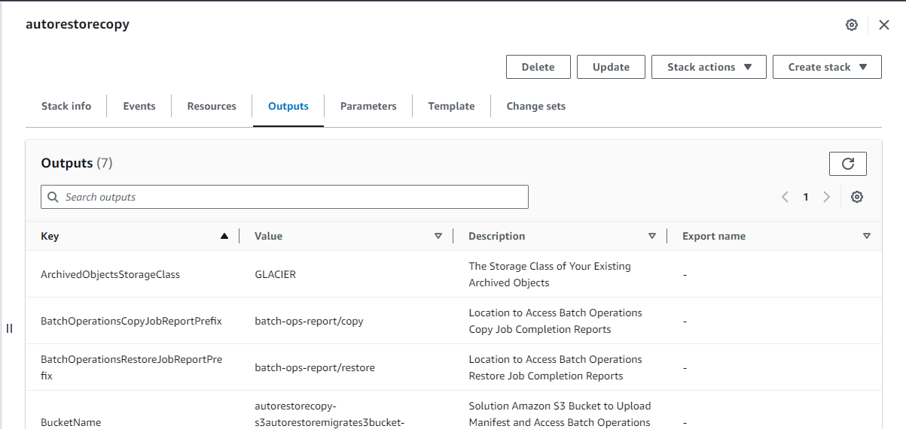

Next go to Amazon S3 Management Console, Buckets and search for the
bucket name. Choose the S3 bucket name and navigate to the
"restore-and-copy/csv-manifest/" prefix. You have the option of
uploading a manifest for objects without a [**version-id** or with
**version-ids**](https://docs.aws.amazon.com/AmazonS3/latest/userguide/batch-ops-create-job.html#specify-batchjob-manifest).

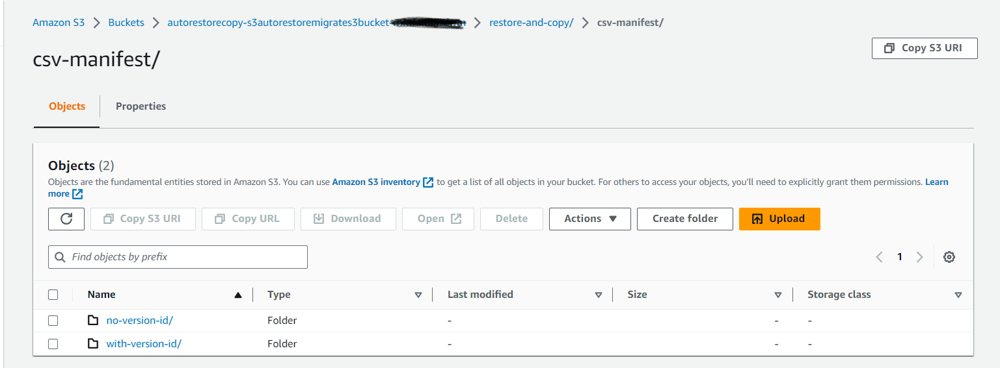

For example, if the bucket containing your Archived data does not have
versioning enabled you should upload the CSV manifest to the
"restore-and-copy/csv-manifest/no-version-id/".

If you have confirmed the subscription to the solution SNS Topic, you
will receive email notifications with details of each JobID and the
number of successful and failed tasks.

You can also track the status of the restore and copy Jobs using the
Amazon S3 Management Console at the Batch Operations Section if you want
to see additional details about each Job and access the detailed Batch
operations Job report. Each Job created by the solution has the
"*AutoRestoreMigrate Solution*" string in it, for example a restore job
will have "*Restore Job by AutoRestoreMigrate Solution for S3Bucket:
YourS3BucketName*\" as the description, copy Jobs will have the
description \"*Lambda Invoke Copy Job by AutoRestoreMigrate Solution for
S3Bucket: YourS3BucketName*\"

To check detailed status of a Job, follow below steps:

1.  Go to the [Amazon S3
    console](https://s3.console.aws.amazon.com/s3/home).

2.  From the navigation pane, choose **Batch Operations** and choose the
    correct AWS Region, then type your search parameter using the JobID
    or description.

3.  Choose the JobID, to display Job specific details. See this
    [link](https://docs.aws.amazon.com/AmazonS3/latest/userguide/batch-ops-job-status.html)
    for more details about tracking Job status.

There is an **EventDrivenCopy** CloudWatch Dashboard deployed as part of the stack resources when the value of the stack parameter **CopyMethod** is set to *Copy immediately restore is completed with S3 Event notifications* .You can use the dashbaord to track the number of object restore completed events, events in the queue and number of Lambda copy invocations attempts. 

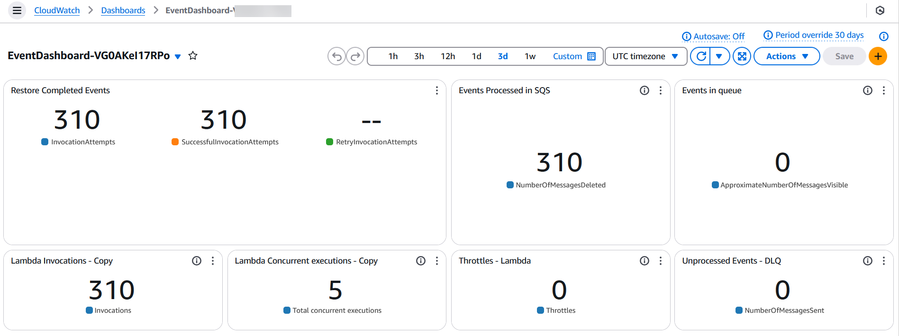


<a name="copy-workflow-for-restored-objects"></a>
## Copy Workflow for Restored objects 

The solution provides two method of copying (Stack parameter: CopyMethod) the restored objects namely :


1. Copy with Batch Operations and Lambda after delay period
2. Copy immediately restore is completed with S3 Event notifications


<a name="batch-operations-copy-after-delay"></a>
_**Copy with Batch Operations and Lambda after delay period:**_

The first option copies the restored objects after a specific wait time, which is based on the source object archive storage class and the restore tier as defined in the Amazon S3 [documentation](https://docs.aws.amazon.com/AmazonS3/latest/userguide/restoring-objects.html). For example if you specify in the stack parameter the source object storage class to be  “Glacier” and restore tier as “Standard” then the delay period is 5 hours. A scheduled event rule checks the restore completion time of each restore job stored in a DynamoDB table, determines if it is eligible for copy and initiate an S3 Batch Operations Lambda invoke copy job for the successfully restored objects. You can see the status of each object to confirm if the copy was successful or failed, for failed copy jobs, by reviewing the [Batch Operations completion report](https://docs.aws.amazon.com/AmazonS3/latest/userguide/batch-ops-examples-reports.html), the error message returned by Amazon S3, including the S3 [RequestID and Extended RequestId](https://docs.aws.amazon.com/AmazonS3/latest/API/get-request-ids.html) is included.

When you have multiple deployments of the solution stack for the same Amazon S3 bucket using this copy method, only the keys included in each restore job is included in the Batch Operations copy job.

<a name="event-driven-copy-job"></a>
**_Copy immediately restore is completed with S3 Event notifications:_**

The second option relies on Amazon S3 event notifications, Amazon Eventbridge rule, Amazon SQS, Step function and Lambda to perform the copy. When you select this option in the stack parameter, S3 event notification to Eventbridge is enabled for your archive source bucket. An event rule is created to trigger when a “Object Restore Completed” is received. Notification and copy action and result for each object is stored in a second DynamoDB table. You can see the status of each object to confirm if the copy was successful or failed, for failed copy jobs, the error message returned by Amazon S3, including the S3 [RequestID and Extended RequestId](https://docs.aws.amazon.com/AmazonS3/latest/API/get-request-ids.html) is included.

**_Note:_** 

* There are additional costs associated with using this copy method, this includes Eventbridge, SQS, and Lambda. Large number of restore objects will lead to a large number of invocations. Amazon S3, Eventbridge and SQS provides at-least-once event delivery to targets, so in rare cases, there might be more than one invocation per restored object. 
* The S3 Notification EventBridge rule is configured based on the archive bucket name and the prefix, if provided. If you did not specify a prefix, then the event rule is triggered for any “Object Restore Completed” within the whole bucket. If a prefix is specified, then the event rule is filtered to trigger the target for only objects matching the prefix. Moreover, if you initiate a restore job via any other means, outside of the solution, and the object key matches the archive bucket prefix, if defined or within the whole bucket, if prefix is not specified, the solution will perform a copy anytime it receives an “Object Restore Completed” notification based on the stack parameters for example the destination bucket. If you do not want the solution to respond to and copy objects based on restore completed events received, please delete the stack, disable the rule or update the stack parameters to the first option “Copy with Batch Operations and Lambda after delay period”.
* When you have multiple deployments of the solution for the same archive/source Amazon S3 bucket using this copy method, it is recommended that you specify the archive/source bucket prefix for each so that the EventBridge rule is filtered based on the specified prefix and the copy job will be processed based on each deployment parameters.  


<a name="redrive-failed-copy-jobs"></a>
## Redrive Failed Copy Jobs 

You can redrive failed copy jobs using the redrive process outlined below. By default, copy redrive uses Amazon S3 Batch Operations Invoke Lambda operation to perform the copy.

<a name="redrive-failed-batch-operations-copy"></a>
### Redriving copy when Copy with Batch Operations and Lambda after delay period is selected

If the first copy method “Copy with Batch Operations and Lambda after delay period” is selected. You can redrive failed copy jobs by simply copying the failed completion report CSV to a prefix in the solution bucket. To identify the failed copy completion report, please follow [this guide](https://docs.aws.amazon.com/AmazonS3/latest/userguide/batch-ops-examples-reports.html).

There are two redrive paths automatically created in the solutions bucket for this copy method, namely "redrive-failed-copy/csv-manifest/with-version-id/" and "redrive-failed-copy/csv-manifest/no-version-id/". Please copy the failed completion report to the relevant prefix/path using the [Amazon S3 Console or AWS-CLI](https://docs.aws.amazon.com/AmazonS3/latest/userguide/copy-object.html#CopyingObjectsExamples). This will trigger another copy job to the destination bucket.

<a name="redrive-failed-event-driven-copy"></a>
### Redriving copy when Copy immediately restore is completed with S3 Event notifications is selected

For the second copy method, please retrieve the list of failed copy task from the DynamoDB table “StackName-EventDynamoDBTable-**”. You can use any form query tools to export the list to a CSV format, for example [PartiQL editor](https://docs.aws.amazon.com/amazondynamodb/latest/developerguide/ql-gettingstarted.html) of your preferred query tool or DynamoDB Athena connectors, please refer to the two guides [link1](https://docs.aws.amazon.com/athena/latest/ug/connectors-dynamodb.html) and [link2](https://docs.aws.amazon.com/prescriptive-guidance/latest/patterns/access-query-and-join-amazon-dynamodb-tables-using-athena.html#access-query-and-join-amazon-dynamodb-tables-using-athena-epics). 

Please see below sample PartiQL editor SQL query to retrieve the list of successful and failed object copy:

**_Successful:_**

Un-versioned S3 bucket:


>SELECT bucket_name, obj_key FROM "archive-restore-EventDynamoDBTable" WHERE "bucket_name" = 'MY-ARCHIVE-BUCKET' AND "s3_key_copy_status" = 'Successful' 


Versioning enabled S3 bucket:


>SELECT bucket_name, obj_key, obj_ver FROM "archive-restore-EventDynamoDBTable" WHERE "bucket_name" = 'MY-ARCHIVE-BUCKET' AND "s3_key_copy_status" = 'Successful' 


**_Failed:_**

Un-versioned S3 bucket:


>SELECT bucket_name, obj_key FROM "archive-restore-EventDynamoDBTable" WHERE "bucket_name" = 'MY-ARCHIVE-BUCKET' AND "s3_key_copy_status" = 'Failed'


Versioning enabled S3 bucket:


>SELECT bucket_name, obj_key, obj_ver FROM "archive-restore-EventDynamoDBTable" WHERE "bucket_name" = 'MY-ARCHIVE-BUCKET' AND "s3_key_copy_status" = 'Failed'


Download the query results of the failed copy jobs, and remove the first row. You an remove the first row using a variety of tools, see example below:

_Linux terminal:_

>  sed '1d' input.csv > output.csv   

_Windows powershell:_

> (Get-Content -Path failed-copy-results.csv -Encoding UTF8) | Select-Object -Skip 1 | Set-Content -Path no-headers-failed-copy-results.csv  -Encoding UTF8 

Then navigate to the solution Amazon S3 bucket path *'redrive-failed-copy/eventbridge/with-version-id/*' for versioning enabled bucket or *'redrive-failed-copy/eventbridge/no-version-id/'* for Un-versioned buckets and upload the result CSV file. You can read more about un-versioned and versioning-enabled Amazon S3 buckets [here](https://docs.aws.amazon.com/AmazonS3/latest/userguide/Versioning.html)

<a name="performance-and-troubleshooting"></a>
## Performance and Troubleshooting

The solution uses the Amazon S3 Batch Operations Lambda Invoke Job for
the copy operation. Not all objects larger than 5 GB can be copied
within the current Lambda function 15-minute timeout limit, especially
across AWS Regions. The solution has been tested successfully, under
ideal conditions, with up to 2-TB single objects size in the same region
and with a 1-TB single object size between two regions EU-WEST-2 and
US-EAST-1.

The template contains some predefined values that apply to the Lambda
function Boto3 SDK code, mainly: **SDKThroughput** [max_concurrency, max_pool_connections] : *200*, **max_retries** [specified in mappings]: *100*, **multipart_threshold**: *5368709120* and
**multipart_chunksize**: *16777216*. You can optionally modify the SDK
parameters as required. For example, you can reduce the **SDKThroughput** down to 60 or 120 if your
source and destination bucket are the same or within the same AWS Region
from the region the solution and Archive bucket is created.
Alternatively, you might want to increase it, if you have very large
individual object sizes for example several hundred gigabytes to
terabytes, you need to copy data across AWS regions and if the
predefined parameters are insufficient.

The solution is dependent on the availability and performance of
multiple underlying AWS services including S3, Lambda and IAM services.

Amazon S3 Batch Operations (BOPs) is an at least once execution engine,
which means it performs at least one invocation per key in the provided
manifest. In rare cases, there might be more than one invocation per
key, this might lead to task failures.

The values of SDK configuration settings **SDKThroughput** [max_concurrency, max_pool_connections] is set to a high value, please note that due to the increased request rates, you might experience throttling from Amazon S3 during the Copy Operation. Excessive throttling can lead to longer running tasks, and possible task failures.

As a best practice, we recommend applying a [lifecycle
expiration](https://docs.aws.amazon.com/AmazonS3/latest/userguide/mpu-abort-incomplete-mpu-lifecycle-config.html)
rule to expire incomplete multipart uploads to your S3 bucket that might
be caused by failed tasks as a result of Lambda function timeouts.

To address performance issues, please refer to [S3 performance
guidelines](https://docs.aws.amazon.com/AmazonS3/latest/userguide/optimizing-performance.html).
I have also provided some quick tips below:

1.  Consider enabling [S3 Request
    metrics](https://docs.aws.amazon.com/AmazonS3/latest/userguide/metrics-configurations.html)
    to track and monitor the request rates and number of 5XX errors on
    your S3
    [bucket](https://docs.aws.amazon.com/AmazonS3/latest/userguide/configure-request-metrics-bucket.html).

2.  Please consider reducing your request rate, by reducing the
    "max_concurrency" and "max_pool_connections" to a lower value, by
    updating the CloudFormation Stack parameters before starting the
    Job.

3.  Job tasks that failed with "Task timed out after 9xxx seconds" is
    caused by the Lambda function timeout. Possible reasons for Lambda
    timeout include S3 throttling causing the function to keep retrying
    the task until the function times out, it can also be caused if the
    object size is too large to be copied within the lambda timeout
    limit. Please adjust the SDK configurations as needed to meet your
    unique requirements.

4.  S3 Batch Operations will utilize all available Lambda concurrency,
    up to 1,000. If you have a need to reserve some concurrency for
    other Lambda functions, you can optionally reduce the concurrency
    used by a Lambda function by setting the reserved concurrency in the
    **Stack** parameter **"CopyFunctionReservedConcurrency",** and
    specify a desired value less than 1,000. Note, setting a value
    impacts the concurrency pool available to other functions.

5.  When Event driven copy is selected, when a large number of messages are in the SQS queue
    Lambda scales out and can consume the concurrency quota in your AWS Account. However, you can 
    control the number of concurrency directly on the SQS to Lambda event source mapping 
    by setting a desired value less than 1,000 using the **Stack** parameter **"CopyFunctionReservedConcurrency",** 

6.  S3 Batch Operations [automatically uses up to 1,000
    TPS](https://docs.aws.amazon.com/AmazonS3/latest/userguide/restoring-objects-retrieval-options.html)
    when restoring objects from S3 Glacier Flexible Retrieval or S3
    Glacier Deep Archive for both archive retrieval options.


7.  If issues with slow performance, excessive throttling, or other
    issues persist, contact AWS Support with the error message and [S3
    RequestID and Extended
    RequestID](https://docs.aws.amazon.com/AmazonS3/latest/userguide/get-request-ids.html)
    in the Amazon S3 Batch Operations failure
    [report](https://docs.aws.amazon.com/AmazonS3/latest/userguide/batch-ops-examples-reports.html)
    or [function CloudWatch
    Logs](https://docs.aws.amazon.com/lambda/latest/dg/python-logging.html),
    for additional support. You can also get S3 requestIDs by querying
    [S3 Access or
    Cloudtrail](https://docs.aws.amazon.com/AmazonS3/latest/userguide/logging-with-S3.html)
    logs if enabled.

For very large workloads; hundreds of millions of objects or Terabytes
of data or critical workloads with tight deadlines, please consider
contacting your AWS Account contact before starting the restore and copy
process.

<a name="cleanup"></a>
## Cleaning up

There are costs associated with using this solution including S3
requests and Lambda function invocation costs.

A lifecycle rule automatically applied to the solution Amazon S3 bucket
expires all objects after 180 days, if you need to retain the data for a
longer period, please copy them to another bucket.

As an optional step, remember to clean up the resources used for this
setup if they are no longer required. To remove the resources, go to the
[Cloudformation
console](https://console.aws.amazon.com/cloudformation/), select the
**Stack** and then choose **Delete**. The solution S3 bucket is retained
after **Stack** deletion, to allow you access the S3 Batch Operations
Job reports, inventory and CSV manifests. After you delete the Stack,
you can optionally [modify the lifecycle
rule](https://docs.aws.amazon.com/AmazonS3/latest/userguide/how-to-set-lifecycle-configuration-intro.html)
to 1 day if you do not want to keep the data, this will expire the
objects and you can delete the bucket as soon as it is empty.


<a name="additional-resources"></a>
## Additional resources

-   [AWS CloudFormation product
    page](https://aws.amazon.com/cloudformation/)

-   [S3 Batch Operations
    documentation](https://docs.aws.amazon.com/AmazonS3/latest/userguide/batch-ops.html)

-   [AWS Lambda product page](https://aws.amazon.com/lambda/)

-   [Amazon S3 pricing page](https://aws.amazon.com/s3/pricing/)

-   [AWS Lambda pricing page](https://aws.amazon.com/lambda/pricing/)

-   [Amazon CloudWatch](https://aws.amazon.com/cloudwatch/)

-   [Amazon S3 Performance Guidelines](https://docs.aws.amazon.com/AmazonS3/latest/userguide/optimizing-performance.html)

-   [AWS Lambda Performance Guidelines](https://docs.aws.amazon.com/lambda/latest/operatorguide/perf-optimize.html)

-   [Message Queing Service - Amazon Simple Queue Service (SQS) - AWS](https://aws.amazon.com/sqs/)    

-   [Push Notification Service - Amazon Simple Notification Service (SNS) - AWS](https://aws.amazon.com/sns/)

-   [Fast NoSQL Key-Value Database -- Amazon DynamoDB -- Amazon Web Services](https://aws.amazon.com/dynamodb/)

-   [What is IAM? - AWS Identity and Access Management (amazon.com)](https://docs.aws.amazon.com/IAM/latest/UserGuide/introduction.html)

-   [Lambda Event Source Mapping Blog ](https://aws.amazon.com/blogs/compute/introducing-maximum-concurrency-of-aws-lambda-functions-when-using-amazon-sqs-as-an-event-source/)    
